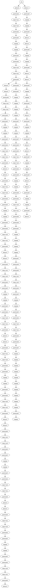

# VA-Project

## Description

Mistford, a mid-sized city near a nature preserve, faces a decline in the population of a local bird species. Mitch Vogel, an ornithology student, seeks to understand the cause. He notices unusual vehicle behaviors in the nearby nature preserve and wants help analyzing vehicle data to aid his investigation.

## Ground Truth 

There is a truck that visits a Ranger Station in a fairly remote part of the Preserve periodically throughout the dataset 
timeline that is illicitly dumping factory waste. It is registering in the data as a non-Ranger vehicle, visiting a Ranger-Stop. The dumping has a slight effect on the visits to the campground nearby

## Data

Download the data [here](https://drive.google.com/file/d/1NEEWqkvGjYIHV9OP1xp2IZi9CAcg5HEC/view?usp=sharing)

The provided dataset consists of traffic data collected from sensors placed around the Boonsong Lekagul Nature Preserve. These sensors track vehicles entering and exiting the preserve through official entrances, as well as their movements within the preserve.

When vehicles enter the Preserve, they must proceed through a gate and obtain a pass.  The gate categorizes vehicles as follows:
1.	2 axle car (or motorcycle)
2.	2 axle truck
3.	3 axle truck
4.	4 axle (and above) truck
5.	2 axle bus
6.	3 axle bus

Vehicles receiving a pass with a “P” appended to their category are park service vehicles that have access to all parts of the Preserve.  Currently, the Preserve vehicles are only 2 axle trucks, so they are designated as “2P” vehicle type.
There are five types of sensors recording data.  
1.	Entrances.  All vehicles pass through an Entrance when entering or leaving the Preserve. 
2.	General-gates.  All vehicles may pass through these gates.  These sensors provide valuable information for the Preserve Rangers trying to understand the flow of traffic through the Preserve. 
3.	Gates.  These are gates that prevent general traffic from passing.  Preserve Ranger vehicles have tags that allow them to pass through these gates to inspect or perform work on the roadway beyond.  
4.	Ranger-stops.  These sensors represent working areas for the Rangers, so you will often see a Ranger-stop sensor at the end of a road managed by a Gate.  Some Ranger-stops are in other locations however, so these sensors record all traffic passing by. 
5.	Camping.  These sensors record visitors to the Preserve camping areas.  Visitors pass by these entering and exiting a campground. 
The Preserve Map

The contractors working with the Nature Preserve rangers have provided a map that presents the Preserve in terms of a 200x200 gridded area. The grid is oriented with north at the top of the map. Grid location (0,0) is at the lower left corner of the map (the SW corner). They have superimposed both the roadways and the sensor locations on this grid.  The map shows an area 12 miles x 12 miles.  
Roadways are indicated by white colored pixels on the map.  Each sensor type has its own unique color: Entrances (green), General-gates (blue), Gates (red), Ranger-stops (yellow), and Camping (orange).
Other information about the dataset:
1.	Traffic either passes through the Preserve, stay as day campers, or stay as extended campers.
2.	Preserve Rangers stay at the ranger-base toward the southeast of the Preserve when they are not working in the Preserve.
3.	The speed limit through the Preserve is 25 mph.
4.	The Preserve area does not observe “Daylight Savings Time”.
5.	The roadways traveling southward from Entrances 3 and 4 do continue to other roadways outside of the Preserve area, but these are not shown on the map.  Vehicle data will not reflect travel beyond the Preserve in this direction.  

Map 

Data Snippet  (.csv format)

Data Fields:
Timestamp:  the date and time the sensor reading was taken
Car-id:  the assigned car ID from the entry gate
Car-type: Vehicle type as enumerated above.  “P” is appended when it is a park vehicle.
Gate-name:  name of the sensors taking the reading. 

## Time Analysis of Traffic Flux

### Mean and Std of Total Traffic Flux at each Gate

* Add insights 

### Traffic Flux by Car Type

#### Aggregated over a day

* add insights

#### Aggregated over a week

* add insights

### Traffic Flux at each Gate

#### Aggregated over a day

#### Aggregated over a week

## Network Analysis

### Car Type 1

* Edge width shows number of cars passing
* Blue nodes are stop were car just passed 
* Green nodes are nodes were car have two consecutive readings 
* Intensity of green color represents average time between two consecutive readings.

## Route Analysis (Tree)

## Car Type 1

